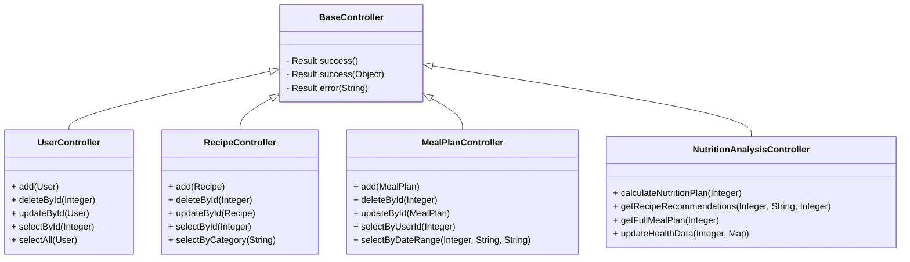

# 健康食谱管理与膳食规划系统
## 概要设计文档

## 1. 文档概述

### 1.1 文档目的
本文档旨在详细说明健康食谱管理与膳食规划系统的概要设计方案，包括系统架构、模块划分、数据结构、类图设计、API规范等内容，为系统的详细设计、开发和测试提供技术指导。

### 1.2 术语定义
| 术语 | 解释 |
|------|------|
| 食谱 | 包含食材、烹饪步骤、营养信息等的完整烹饪指南 |
| 膳食计划 | 用户根据个人需求制定的每日/每周餐饮安排 |
| BMI | 体重指数，用于评估人体体重与身高的比例是否健康 |
| BMR | 基础代谢率，维持身体基本功能所需的最低能量消耗 |
| TDEE | 总能量消耗，包括基础代谢、活动消耗等在内的每日总能量消耗 |
| OSS | 对象存储服务，用于存储系统中的图片等文件资源 |

## 2. 系统架构设计

### 2.1 系统整体架构

本系统采用前后端分离的单模块架构。整体架构分为：

- **前端层**：基于Vue 3.x构建的SPA应用
- **后端层**：基于Spring Boot的单体应用
- **数据层**：MySQL数据库


### 2.2 技术选型

| 分类 | 技术 | 版本 | 用途 |
|------|------|------|------|
| 前端框架 | Vue | 3.x | 构建用户界面 |
| UI组件库 | Element Plus | 2.x | 前端UI组件 |
| HTTP客户端 | Axios | 1.x | 前端API请求 |
| 后端框架 | Spring Boot | 2.7.x | 后端应用框架 |
| ORM框架 | MyBatis | 3.5.x | 数据库访问 |
| 认证机制 | 自定义认证实现 | - | 用户认证与授权 |
| 数据库 | MySQL | 8.x | 关系型数据库 |
| 对象存储 | 阿里云OSS | - | 存储用户头像、食谱图片等文件 |

### 2.3 模块划分

本系统划分为以下功能模块：

| 模块名称 | 主要职责 | 对应文件 |
|---------|---------|----------|
| 用户模块 | 用户注册、登录、个人信息管理 | UserController.java |
| 食谱模块 | 食谱的查看和搜索操作 | RecipeController.java |
| 膳食计划模块 | 膳食计划的查看和管理 | MealPlanController.java |
| 营养分析模块 | 营养需求计算、健康建议 | NutritionAnalysisController.java |
| 管理员模块 | 系统管理、用户管理 | AdminController.java |
| 文件管理模块 | 文件上传、下载、管理 | FileController.java |

## 3. 数据结构设计

### 3.1 核心实体类

#### 3.1.1 Account（用户基类）
```java
public class Account {
    private Integer id;            // 用户ID
    private String username;       // 用户名
    private String name;           // 姓名
    private String password;       // 密码
    private String role;           // 角色标识
    private String newPassword;    // 新密码（用于密码修改）
    private String avatar;         // 头像
    // getter和setter方法
}
```

#### 3.1.2 User（普通用户）
```java
public class User extends Account {
    private Double height;         // 身高(cm)
    private Double weight;         // 体重(kg)
    private Integer age;           // 年龄
    private String gender;         // 性别
    private String activityLevel;  // 活动水平
    private String goal;           // 健康目标
    // getter和setter方法
}
```

#### 3.1.3 Recipe（食谱）
```java
public class Recipe {
    private Integer id;            // 食谱ID
    private String name;           // 食谱名称
    private String description;    // 食谱描述
    private String ingredients;    // 食材清单(JSON格式)
    private String steps;          // 烹饪步骤(JSON格式)
    private Integer cookingTime;   // 烹饪时间(分钟)
    private Integer calories;      // 热量(卡路里)
    private BigDecimal protein;    // 蛋白质(g)
    private BigDecimal carbohydrate; // 碳水化合物(g)
    private BigDecimal fat;        // 脂肪(g)
    private String category;       // 分类(早餐、午餐等)
    private String difficulty;     // 难度(简单、中等、困难)
    private String image;          // 食谱图片URL
    private LocalDateTime createTime; // 创建时间
    private LocalDateTime updateTime; // 更新时间
    // getter和setter方法
}
```

#### 3.1.4 MealPlan（膳食计划）
```java
public class MealPlan {
    private Integer id;            // 膳食计划ID
    private Integer userId;        // 用户ID
    private String planName;       // 计划名称
    private LocalDate planDate;    // 计划日期
    private String mealType;       // 餐次类型(早餐、午餐、晚餐、加餐)
    private Integer recipeId;      // 关联的食谱ID
    private String customMeal;     // 自定义餐食内容
    private Integer calories;      // 热量(卡路里)
    private String notes;          // 备注
    private LocalDateTime createTime; // 创建时间
    private LocalDateTime updateTime; // 更新时间
    private Recipe recipe;         // 关联的食谱信息
    // getter和setter方法
}
```

### 3.2 数据库设计

#### 3.2.1 表结构设计

**`user`表**
| 字段名 | 数据类型 | 约束 | 描述 |
|--------|----------|------|------|
| `id` | `INT` | `PRIMARY KEY AUTO_INCREMENT` | 用户ID |
| `username` | `VARCHAR(50)` | `UNIQUE NOT NULL` | 用户名 |
| `password` | `VARCHAR(100)` | `NOT NULL` | 密码(加密存储) |
| `name` | `VARCHAR(50)` | `NOT NULL` | 真实姓名 |
| `avatar` | `VARCHAR(255)` | | 头像URL |
| `role` | `VARCHAR(20)` | `NOT NULL` | 角色标识 |
| `phone` | `VARCHAR(20)` | | 手机号 |
| `email` | `VARCHAR(100)` | | 邮箱 |
| `height` | `DOUBLE` | | 身高(cm) |
| `weight` | `DOUBLE` | | 体重(kg) |
| `age` | `INT` | | 年龄 |
| `gender` | `VARCHAR(10)` | | 性别 |
| `activity_level` | `VARCHAR(20)` | | 活动水平 |
| `goal` | `VARCHAR(50)` | | 健康目标 |

**`recipe`表**
| 字段名 | 数据类型 | 约束 | 描述 |
|--------|----------|------|------|
| `id` | `INT` | `PRIMARY KEY AUTO_INCREMENT` | 食谱ID |
| `name` | `VARCHAR(100)` | `NOT NULL` | 食谱名称 |
| `description` | `TEXT` | | 食谱描述 |
| `ingredients` | `TEXT` | `NOT NULL` | 食材清单(JSON格式) |
| `steps` | `TEXT` | `NOT NULL` | 烹饪步骤(JSON格式) |
| `cooking_time` | `INT` | `NOT NULL` | 烹饪时间(分钟) |
| `calories` | `INT` | `NOT NULL` | 热量(卡路里) |
| `protein` | `DECIMAL(8,2)` | `NOT NULL` | 蛋白质(g) |
| `carbohydrate` | `DECIMAL(8,2)` | `NOT NULL` | 碳水化合物(g) |
| `fat` | `DECIMAL(8,2)` | `NOT NULL` | 脂肪(g) |
| `category` | `VARCHAR(20)` | `NOT NULL` | 分类 |
| `difficulty` | `VARCHAR(20)` | `NOT NULL` | 难度 |
| `image` | `VARCHAR(255)` | | 食谱图片URL |
| `create_time` | `DATETIME` | `NOT NULL` | 创建时间 |
| `update_time` | `DATETIME` | `NOT NULL` | 更新时间 |

**`meal_plan`表**
| 字段名 | 数据类型 | 约束 | 描述 |
|--------|----------|------|------|
| `id` | `INT` | `PRIMARY KEY AUTO_INCREMENT` | 膳食计划ID |
| `user_id` | `INT` | `NOT NULL, FOREIGN KEY REFERENCES user(id)` | 用户ID |
| `plan_name` | `VARCHAR(100)` | `NOT NULL` | 计划名称 |
| `plan_date` | `DATE` | `NOT NULL` | 计划日期 |
| `meal_type` | `VARCHAR(20)` | `NOT NULL` | 餐次类型 |
| `recipe_id` | `INT` | `FOREIGN KEY REFERENCES recipe(id)` | 关联的食谱ID |
| `custom_meal` | `TEXT` | | 自定义餐食内容 |
| `calories` | `INT` | | 热量(卡路里) |
| `notes` | `TEXT` | | 备注 |
| `create_time` | `DATETIME` | `NOT NULL` | 创建时间 |
| `update_time` | `DATETIME` | `NOT NULL` | 更新时间 |

### 3.3 数据传输对象（DTOs）

**`LoginRequest`**
```java
public class LoginRequest {
    private String username;
    private String password;
    // getter和setter方法
}
```

**`NutritionPlanResponse`**
```java
public class NutritionPlanResponse {
    private Double bmr;              // 基础代谢率
    private Double tdee;             // 总能量消耗
    private Double recommendedCalories; // 推荐卡路里摄入量
    private Map<String, Double> nutrientRequirements; // 营养素需求
    private String nutritionAdvice;  // 营养建议
    // getter和setter方法
}
```

## 4. 类图设计

### 4.1 核心类图


### 4.2 控制器类图


## 5. 时序图设计

### 5.1 用户登录流程


### 5.2 营养分析流程


### 5.3 膳食计划创建流程


## 6. API接口规范

### 6.1 用户管理接口

| API路径 | 方法 | 模块/文件 | 功能描述 | 请求体 (JSON) | 成功响应 (200 OK) |
|---------|------|----------|----------|--------------|------------------|
| `/user/add` | `POST` | `UserController` | 新增用户 | `{"username": "...", "password": "...", "name": "..."}` | `{"code": 200, "msg": "成功", "data": null}` |
| `/user/delete/{id}` | `DELETE` | `UserController` | 删除用户 | N/A | `{"code": 200, "msg": "成功", "data": null}` |
| `/user/update` | `PUT` | `UserController` | 更新用户信息 | `{"id": 1, "username": "...", "name": "..."}` | `{"code": 200, "msg": "成功", "data": null}` |
| `/user/selectById/{id}` | `GET` | `UserController` | 根据ID查询用户 | N/A | `{"code": 200, "msg": "成功", "data": {"id": 1, "username": "...", "name": "..."}}` |
| `/user/selectAll` | `GET` | `UserController` | 查询所有用户 | N/A | `{"code": 200, "msg": "成功", "data": [{...}, {...}]}` |
| `/user/selectPage` | `GET` | `UserController` | 分页查询用户 | N/A (Query参数) | `{"code": 200, "msg": "成功", "data": {"total": 100, "list": [...]}}` |

### 6.2 食谱管理接口

| API路径 | 方法 | 模块/文件 | 功能描述 | 请求体 (JSON) | 成功响应 (200 OK) |
|---------|------|----------|----------|--------------|------------------|
| `/recipe/add` | `POST` | `RecipeController` | 新增食谱 | `{"name": "...", "ingredients": "...", "steps": "..."}` | `{"code": 200, "msg": "成功", "data": null}` |
| `/recipe/delete/{id}` | `DELETE` | `RecipeController` | 删除食谱 | N/A | `{"code": 200, "msg": "成功", "data": null}` |
| `/recipe/update` | `PUT` | `RecipeController` | 更新食谱信息 | `{"id": 1, "name": "...", "ingredients": "..."}` | `{"code": 200, "msg": "成功", "data": null}` |
| `/recipe/selectById/{id}` | `GET` | `RecipeController` | 根据ID查询食谱 | N/A | `{"code": 200, "msg": "成功", "data": {"id": 1, "name": "...", "ingredients": "..."}}` |
| `/recipe/selectAll` | `GET` | `RecipeController` | 查询所有食谱 | N/A (Query参数) | `{"code": 200, "msg": "成功", "data": [{...}, {...}]}` |
| `/recipe/selectPage` | `GET` | `RecipeController` | 分页查询食谱 | N/A (Query参数) | `{"code": 200, "msg": "成功", "data": {"total": 100, "list": [...]}}` |
| `/recipe/selectByCategory/{category}` | `GET` | `RecipeController` | 根据分类查询食谱 | N/A | `{"code": 200, "msg": "成功", "data": [{...}, {...}]}` |

### 6.3 膳食计划接口

| API路径 | 方法 | 模块/文件 | 功能描述 | 请求体 (JSON) | 成功响应 (200 OK) |
|---------|------|----------|----------|--------------|------------------|
| `/mealPlan/add` | `POST` | `MealPlanController` | 新增膳食计划 | `{"userId": 1, "planName": "...", "planDate": "2024-01-01"}` | `{"code": 200, "msg": "成功", "data": null}` |
| `/mealPlan/delete/{id}` | `DELETE` | `MealPlanController` | 删除膳食计划 | N/A | `{"code": 200, "msg": "成功", "data": null}` |
| `/mealPlan/update` | `PUT` | `MealPlanController` | 更新膳食计划 | `{"id": 1, "planName": "...", "mealType": "早餐"}` | `{"code": 200, "msg": "成功", "data": null}` |
| `/mealPlan/select/{id}` | `GET` | `MealPlanController` | 根据ID查询膳食计划 | N/A | `{"code": 200, "msg": "成功", "data": {"id": 1, "planName": "..."}}` |
| `/mealPlan/selectByUser` | `GET` | `MealPlanController` | 根据用户ID查询膳食计划 | N/A (Query参数) | `{"code": 200, "msg": "成功", "data": [{...}, {...}]}` |
| `/mealPlan/selectByDateRange` | `GET` | `MealPlanController` | 查询日期范围内的膳食计划 | N/A (Query参数) | `{"code": 200, "msg": "成功", "data": [{...}, {...}]}` |
| `/mealPlan/hasPlan` | `GET` | `MealPlanController` | 检查某日期是否有膳食计划 | N/A (Query参数) | `{"code": 200, "msg": "成功", "data": true}` |

### 6.4 文件管理接口

| API路径 | 方法 | 模块/文件 | 功能描述 | 请求体 (JSON) | 成功响应 (200 OK) |
|---------|------|----------|----------|--------------|------------------|
| `/file/upload` | `POST` | `FileController` | 上传文件到OSS | `multipart/form-data` (文件) | `{"code": 200, "msg": "成功", "data": {"url": "文件URL"}}` |
| `/file/download/{fileName}` | `GET` | `FileController` | 从OSS下载文件 | N/A | 文件流 |
| `/file/delete` | `DELETE` | `FileController` | 删除OSS中的文件 | `{"fileName": "文件名"}` | `{"code": 200, "msg": "成功", "data": null}` |
| `/file/preview/{fileName}` | `GET` | `FileController` | 预览OSS中的文件 | N/A | 文件流 |

### 6.5 营养分析接口

| API路径 | 方法 | 模块/文件 | 功能描述 | 请求体 (JSON) | 成功响应 (200 OK) |
|---------|------|----------|----------|--------------|------------------|
| `/nutritionAnalysis/nutritionPlan/{userId}` | `GET` | `NutritionAnalysisController` | 计算用户营养计划 | N/A | `{"code": 200, "msg": "成功", "data": {"bmr": 1500, "tdee": 1800}}` |
| `/nutritionAnalysis/nutritionPlan` | `POST` | `NutritionAnalysisController` | 直接传入用户数据计算营养计划 | `{"height": 175, "weight": 70, "age": 30}` | `{"code": 200, "msg": "成功", "data": {"bmr": 1500, "tdee": 1800}}` |
| `/nutritionAnalysis/recipes` | `GET` | `NutritionAnalysisController` | 获取特定餐别的食谱推荐 | N/A (Query参数) | `{"code": 200, "msg": "成功", "data": [{...}, {...}]}` |
| `/nutritionAnalysis/mealPlan/{userId}` | `GET` | `NutritionAnalysisController` | 生成完整的每日膳食计划 | N/A | `{"code": 200, "msg": "成功", "data": {"breakfast": {...}, "lunch": {...}}}` |
| `/nutritionAnalysis/updateHealthData/{userId}` | `PUT` | `NutritionAnalysisController` | 更新用户健康数据 | `{"height": 175, "weight": 70}` | `{"code": 200, "msg": "成功", "data": null}` |

## 7. 安全设计

### 7.1 认证与授权
- 采用自定义认证实现，基于Session存储用户信息
- 实现简单的角色区分（ADMIN/USER）
- 用户密码采用MD5加盐加密存储
- 实现基本的密码验证机制

### 7.2 数据安全
- 敏感健康数据加密存储
- 阿里云OSS访问凭证通过环境变量管理

## 8. 部署架构

### 8.1 部署架构

本系统采用传统部署方式。部署架构如下：

- **前端部署**：Nginx服务器，静态资源部署
- **后端部署**：Spring Boot应用，独立运行的Java进程
- **数据库部署**：MySQL单实例，存储系统数据


## 9. 性能优化

### 9.1 数据库优化
- 合理设计索引，优化查询性能
- 使用连接池管理数据库连接
- 实现数据库读写分离
- 定期进行数据库备份和优化

### 9.2 缓存优化
- 使用本地内存缓存存储热点数据
- 设置合理的缓存大小上限（maxSize: 1000）
- 设置缓存过期时间（expireTime: 300秒）
- 优化缓存查询效率

### 9.3 代码优化
- 优化SQL查询语句
- 减少不必要的数据库操作
- 使用异步处理耗时操作
- 实现接口的熔断和降级


