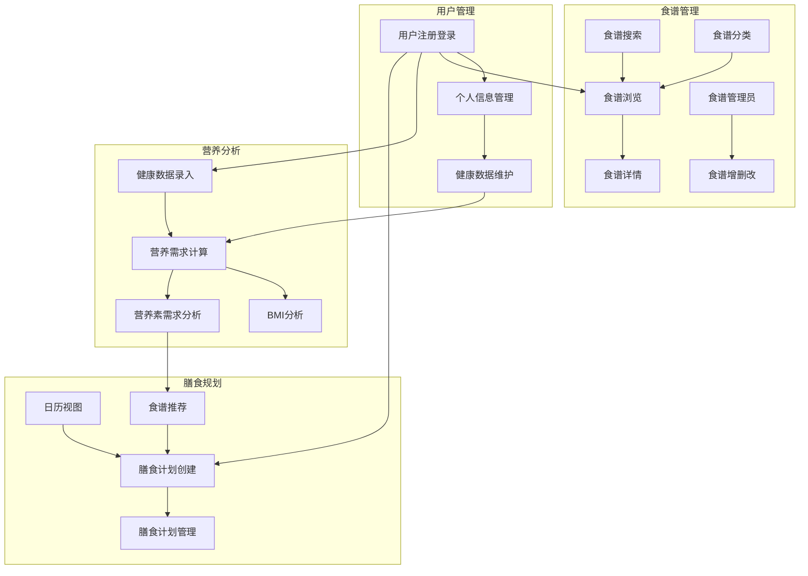
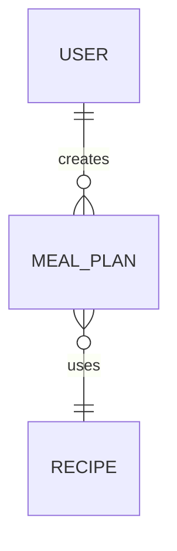
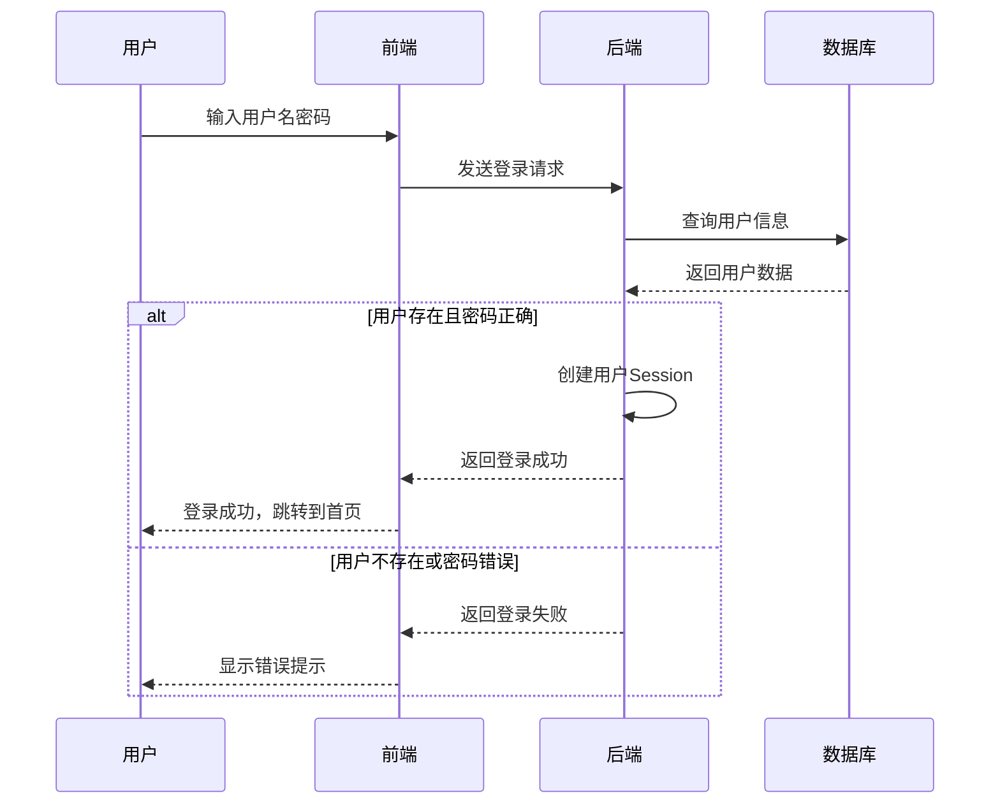
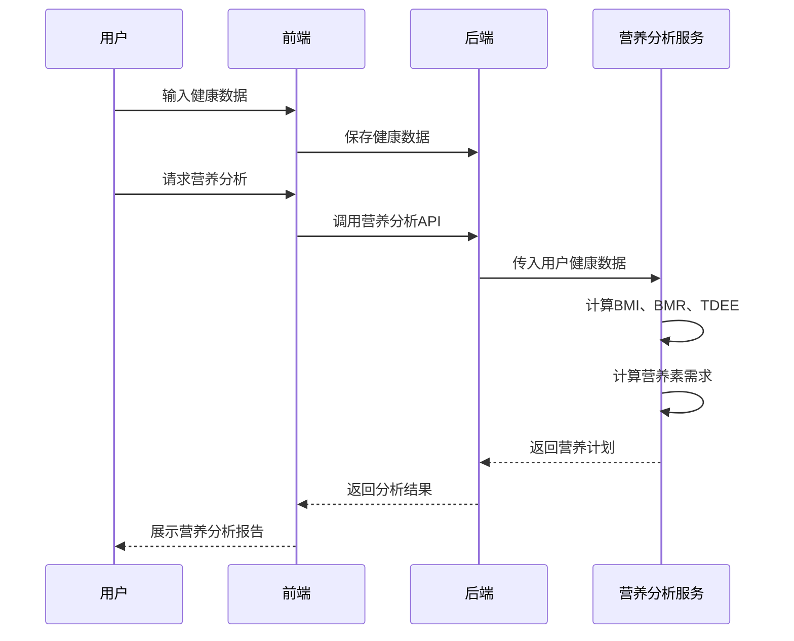
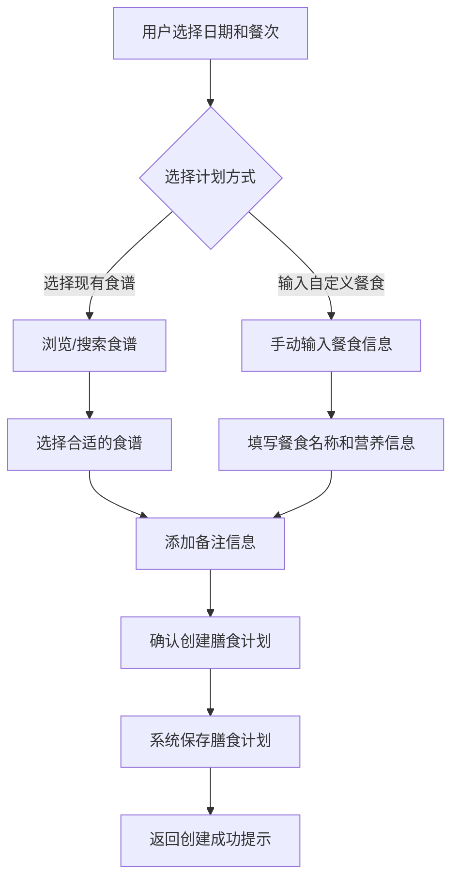

# 健康食谱管理与膳食规划系统
## 需求说明书

## 1. 文档概述

### 1.1 文档目的
本文档旨在详细说明健康食谱管理与膳食规划系统的功能需求、数据需求、安全与合规需求、非功能性需求等内容，为系统的设计、开发、测试和维护提供明确的指导。

### 1.2 术语定义
| 术语 | 解释 |
|------|------|
| 食谱 | 包含食材、烹饪步骤、营养信息等的完整烹饪指南 |
| 膳食计划 | 用户根据个人需求制定的每日/每周餐饮安排 |
| BMI | 体重指数，用于评估人体体重与身高的比例是否健康 |
| BMR | 基础代谢率，维持身体基本功能所需的最低能量消耗 |
| TDEE | 总能量消耗，包括基础代谢、活动消耗等在内的每日总能量消耗 |
| OSS | 对象存储服务，用于存储系统中的图片等文件资源 |

## 2. 系统概述

### 2.1 系统简介
健康食谱管理与膳食规划系统是一个集食谱管理、个性化营养分析、膳食规划为一体的健康管理平台。系统允许用户根据个人健康数据和饮食目标，获取定制化的营养分析和膳食建议，帮助用户实现健康饮食管理。

### 2.2 系统架构
系统采用前后端分离架构：
- **前端**：基于Vue框架开发，使用Element Plus组件库构建用户界面
- **后端**：采用Spring Boot框架，提供RESTful API接口
- **数据库**：MySQL关系型数据库
- **对象存储**：阿里云OSS，用于存储系统中的图片等文件资源

### 2.3 系统功能架构

## 3. 功能需求

### 3.1 用户管理模块

#### 3.1.1 用户注册与登录
| 功能点 | 描述 | 输入 | 输出 |
|--------|------|------|------|
| 用户注册 | 用户通过用户名、密码等信息创建账号 | 用户名、密码、姓名、邮箱、手机号 | 注册成功/失败提示 |
| 用户登录 | 已注册用户通过凭证登录系统 | 用户名、密码 | 登录成功/失败提示、用户信息 |
| 个人信息管理 | 用户查看和修改个人基本信息 | 姓名、头像等基本信息 | 更新后的用户信息 |

#### 3.1.2 健康数据管理
| 功能点 | 描述 | 输入 | 输出 |
|--------|------|------|------|
| 健康数据录入 | 用户录入身高、体重、年龄等健康数据 | 身高(cm)、体重(kg)、年龄、性别、活动水平、健康目标 | 健康数据保存成功/失败提示 |
| 健康数据修改 | 用户修改已录入的健康数据 | 最新的健康数据 | 更新后的健康数据 |
| BMI计算 | 系统根据身高体重自动计算BMI值 | 身高、体重 | BMI值及分类 |

### 3.2 食谱管理模块

#### 3.2.1 食谱浏览与搜索
| 功能点 | 描述 | 输入 | 输出 |
|--------|------|------|------|
| 食谱列表展示 | 分页展示系统中的所有食谱 | 页码、每页数量 | 食谱列表数据 |
| 食谱搜索 | 根据关键词搜索食谱 | 搜索关键词 | 匹配的食谱列表 |
| 食谱分类筛选 | 根据分类（如早餐、午餐、晚餐等）筛选食谱 | 分类信息 | 特定分类的食谱列表 |
| 食谱详情查看 | 查看单个食谱的详细信息 | 食谱ID | 食谱的详细内容（食材、步骤、营养信息等） |

#### 3.2.2 食谱管理（管理员功能）
| 功能点 | 描述 | 输入 | 输出 |
|--------|------|------|------|
| 食谱新增 | 管理员添加新的食谱信息 | 食谱名称、描述、食材、步骤、营养信息等 | 新增食谱成功/失败提示 |
| 食谱编辑 | 管理员修改现有食谱信息 | 更新后的食谱信息 | 更新成功/失败提示 |
| 食谱删除 | 管理员删除指定食谱 | 食谱ID | 删除成功/失败提示 |
| 食谱管理 | 查看和搜索系统中的食谱信息 | - | 食谱列表数据 |

### 3.3 营养分析模块

#### 3.3.1 营养需求计算
| 功能点 | 描述 | 输入 | 输出 |
|--------|------|------|------|
| 营养计划计算 | 根据用户健康数据计算营养需求 | 用户ID | 包含BMR、TDEE、推荐卡路里、营养素需求的营养计划 |
| 营养素需求展示 | 展示各类营养素（蛋白质、碳水化合物、脂肪等）的每日推荐摄入量 | 营养计划数据 | 营养素需求表格 |
| 营养建议生成 | 根据用户健康目标生成个性化营养建议 | 用户健康数据、营养计划 | 文字形式的营养建议 |

### 3.4 膳食规划模块

#### 3.4.1 膳食计划创建与管理
| 功能点 | 描述 | 输入 | 输出 |
|--------|------|------|------|
| 膳食计划创建 | 用户为指定日期和餐次创建膳食计划 | 计划名称、日期、餐次类型、食谱ID或自定义餐食 | 创建成功/失败提示 |
| 膳食计划列表 | 展示用户的所有膳食计划 | 用户ID、筛选条件 | 膳食计划列表数据 |
| 膳食计划编辑 | 修改现有膳食计划信息 | 更新后的膳食计划信息 | 更新成功/失败提示 |
| 膳食计划删除 | 删除指定的膳食计划 | 膳食计划ID | 删除成功/失败提示 |

#### 3.4.2 膳食计划视图
| 功能点 | 描述 | 输入 | 输出 |
|--------|------|------|------|
| 日历视图 | 以日历形式展示膳食计划 | 年月筛选 | 日历形式的膳食计划展示 |
| 列表视图 | 以列表形式展示膳食计划 | 日期范围、餐次类型等筛选条件 | 列表形式的膳食计划数据 |
| 日期筛选 | 根据日期范围筛选膳食计划 | 开始日期、结束日期 | 筛选后的膳食计划数据 |

#### 3.4.3 食谱推荐
| 功能点 | 描述 | 输入 | 输出 |
|--------|------|------|------|
| 餐次食谱推荐 | 根据用户营养需求推荐特定餐次的食谱 | 用户ID、餐次类型、推荐数量 | 推荐食谱列表 |
| 完整膳食计划推荐 | 根据用户营养需求生成完整的每日膳食计划 | 用户ID | 包含各餐次的完整膳食计划 |

### 3.5 文件管理模块

#### 3.5.1 文件上传与管理
| 功能点 | 描述 | 输入 | 输出 |
|--------|------|------|------|
| 头像上传 | 用户上传个人头像图片 | 图片文件 | 头像URL、上传成功/失败提示 |
| 食谱图片上传 | 管理员上传食谱相关图片 | 图片文件 | 图片URL、上传成功/失败提示 |
| 文件格式验证 | 验证上传文件的格式是否符合要求 | 文件 | 格式验证结果 |
| 文件大小限制 | 控制上传文件的大小不超过限制 | 文件 | 大小验证结果 |

#### 3.5.2 文件存储与访问
| 功能点 | 描述 | 输入 | 输出 |
|--------|------|------|------|
| 文件存储 | 将上传的文件存储到阿里云OSS | 文件数据 | 存储成功状态 |
| 文件URL生成 | 为存储的文件生成访问URL | 文件ID | 可访问的文件URL |
| 文件预览 | 提供文件（如图片）的在线预览功能 | 文件URL | 文件预览视图 |
| 文件管理 | 管理员对系统文件进行管理操作 | 文件ID | 管理操作结果 |

## 4. 数据需求

### 4.1 数据实体

#### 4.1.1 用户实体 (User)
| 字段名 | 数据类型 | 约束 | 描述 |
|--------|----------|------|------|
| id | Integer | 主键 | 用户ID |
| username | String | 唯一 | 用户名 |
| password | String | 非空 | 密码 |
| name | String | 非空 | 真实姓名 |
| avatar | String | 可为空 | 头像URL |
| role | String | 非空 | 用户角色 |
| phone | String | 可为空 | 手机号 |
| email | String | 可为空 | 邮箱 |
| height | Double | 可为空 | 身高(cm) |
| weight | Double | 可为空 | 体重(kg) |
| age | Integer | 可为空 | 年龄 |
| gender | String | 可为空 | 性别 |
| activityLevel | String | 可为空 | 活动水平 |
| goal | String | 可为空 | 健康目标 |

#### 4.1.2 食谱实体 (Recipe)
| 字段名 | 数据类型 | 约束 | 描述 |
|--------|----------|------|------|
| id | Integer | 主键 | 食谱ID |
| name | String | 非空 | 食谱名称 |
| description | String | 可为空 | 食谱描述 |
| ingredients | String | 非空 | 食材清单(JSON格式) |
| steps | String | 非空 | 烹饪步骤(JSON格式) |
| cookingTime | Integer | 非空 | 烹饪时间(分钟) |
| calories | Integer | 非空 | 热量(卡路里) |
| protein | BigDecimal | 非空 | 蛋白质(g) |
| carbohydrate | BigDecimal | 非空 | 碳水化合物(g) |
| fat | BigDecimal | 非空 | 脂肪(g) |
| category | String | 非空 | 分类(早餐、午餐等) |
| difficulty | String | 非空 | 难度(简单、中等、困难) |
| image | String | 可为空 | 食谱图片URL |
| createTime | LocalDateTime | 非空 | 创建时间 |
| updateTime | LocalDateTime | 非空 | 更新时间 |

#### 4.1.3 膳食计划实体 (MealPlan)
| 字段名 | 数据类型 | 约束 | 描述 |
|--------|----------|------|------|
| id | Integer | 主键 | 膳食计划ID |
| userId | Integer | 外键 | 用户ID |
| planName | String | 非空 | 计划名称 |
| planDate | LocalDate | 非空 | 计划日期 |
| mealType | String | 非空 | 餐次类型(早餐、午餐、晚餐、加餐) |
| recipeId | Integer | 可为空 | 关联的食谱ID |
| customMeal | String | 可为空 | 自定义餐食内容 |
| calories | Integer | 可为空 | 热量(卡路里) |
| notes | String | 可为空 | 备注 |
| createTime | LocalDateTime | 非空 | 创建时间 |
| updateTime | LocalDateTime | 非空 | 更新时间 |

### 4.2 数据关系

## 5. 安全与合规需求

### 5.1 用户认证与授权
- 实现基于角色的访问控制(RBAC)，区分普通用户和管理员权限
- 用户密码必须进行加密存储，禁止明文保存
- 实现用户会话管理，确保登录状态的安全控制

### 5.2 数据安全
- 敏感健康数据（如体重、身高、BMI等）必须受到保护，仅授权用户可访问
- 数据库连接信息必须通过环境变量或安全方式配置，禁止硬编码在代码中

### 5.3 输入验证与防护
- 所有用户输入必须进行严格验证，防止SQL注入、XSS等常见攻击
- 实现请求参数校验，确保数据格式和内容的合法性
- 基础的文件处理功能安全控制

### 5.4 日志记录
- 系统操作日志必须完整记录关键操作，包括用户登录、数据修改等
- 异常日志必须详细记录错误信息，便于问题排查和安全审计
- 日志内容必须符合数据安全要求，避免记录敏感信息

### 5.5 合规要求
- 系统必须符合个人信息保护相关法律法规
- 健康数据的收集、存储、使用必须遵循相关隐私政策
- 确保系统在处理用户健康数据时的合规性

## 6. 非功能性需求

### 6.1 性能需求
- 系统响应时间：页面加载时间不超过2秒，API响应时间不超过1秒，文件上传响应时间不超过5秒
- 系统并发：支持至少1000用户同时在线
- 数据处理：批量操作时系统响应时间不超过5秒
- 文件上传：支持多用户同时上传文件，单个文件大小限制为10MB

### 6.2 可用性需求
- 系统可用性：99.9%以上（每月计划停机时间不超过43分钟）
- 故障恢复：系统故障后恢复时间不超过30分钟
- 错误处理：所有异常必须有友好的错误提示和日志记录

### 6.3 可维护性需求
- 代码规范：遵循统一的代码规范，包含必要的注释
- 模块化设计：系统功能模块化，便于维护和扩展
- 文档完备：提供完整的系统设计文档、API文档等

### 6.4 兼容性需求
- 浏览器支持：兼容Chrome 90+、Firefox 88+、Safari 14+、Edge 90+
- 分辨率支持：最小支持1024x768分辨率，最佳体验为1920x1080

## 7. 系统流程图

### 7.1 用户登录流程

### 7.2 营养分析流程

### 7.3 膳食计划创建流程

## 8. 实施建议

### 8.1 开发优先级
1. 核心用户管理和认证功能
2. 基础食谱管理功能
3. 营养分析计算功能
4. 膳食计划管理功能
5. 食谱推荐功能

### 8.2 测试重点
- 用户认证和授权机制的安全性测试
- 营养计算的准确性测试
- 数据库性能和并发访问测试
- 敏感数据保护的安全测试

### 8.3 部署建议
- 采用容器化部署，提高系统可扩展性
- 数据库使用MySQL，文件存储使用阿里云OSS
- 实施定期备份策略，确保数据安全
- 配置CDN加速静态资源访问
- 确保OSS环境变量正确配置：endpoint、accessKeyId、accessKeySecret和bucketName

## 9. 风险评估

| 风险点 | 影响程度 | 可能性 | 缓解措施 |
|--------|----------|--------|----------|
| 用户健康数据泄露 | 高 | 中 | 实施强加密、访问控制、定期安全审计 |
| 营养计算不准确 | 中 | 中 | 建立严格的算法测试和验证机制 |
| 系统性能瓶颈 | 高 | 低 | 实施性能监控、优化数据库查询、使用缓存 |
| 文件存储费用过高 | 中 | 中 | 实施文件压缩、定期清理、合理配置存储类型 |
| 第三方API依赖风险 | 高 | 低 | 建立备用方案、完善错误处理机制 |

